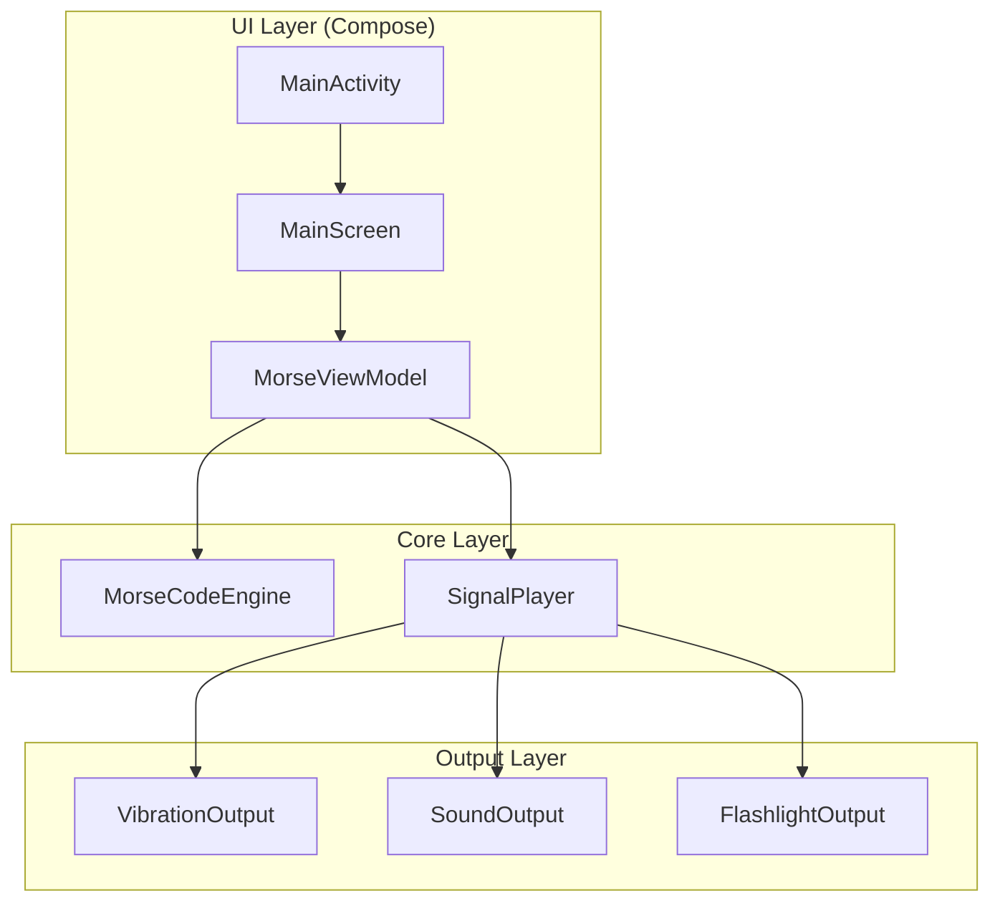

# Android Morse Code 报时应用

构建一个原生 Android 应用（Kotlin + Jetpack Compose），通过 **振动**、**声音** 和 **闪光灯** 三种方式以 Morse 电码播报当前时间。UI 采用简约深色主题设计，现代感强。

## User Review Required

> [!IMPORTANT]
> **技术栈选择**：使用 **Kotlin + Jetpack Compose + Material 3** 构建，最低支持 API 26 (Android 8.0)。需要确认您是否同意此技术栈。

> [!NOTE]
> **闪光灯兼容性**：闪光灯功能依赖 `Camera2 API`，部分设备可能无闪光灯硬件。应用会自动检测并在不支持时禁用该选项。

## Proposed Changes

### Morse 编码核心

#### [NEW] [MorseCodeEngine.kt](file:///d:/codebuddy/morsecode_android/app/src/main/java/com/morsecode/android/morse/MorseCodeEngine.kt)

Morse 电码核心引擎：
- 数字 0-9 的 Morse 编码映射表
- `encodeTime(hour, minute)` → 将时间转成 Morse 字符串（如 `"·−−−−  ··−−−   ·−···  ····−"`）
- `generateSignalSequence(morseString)` → 将 Morse 字符串转为信号序列（ON/OFF + 持续时间 ms）
- 时间参数：短信号 (·) 200ms，长信号 (−) 600ms，符号间隔 200ms，字符间隔 600ms，时/分分隔 1200ms

---

### 信号输出模块

#### [NEW] [SignalPlayer.kt](file:///d:/codebuddy/morsecode_android/app/src/main/java/com/morsecode/android/signal/SignalPlayer.kt)

统一的信号播放控制器，协调三种输出：
- 管理播放状态（播放中 / 已停止）
- 支持同时启用多种输出方式
- 提供播放进度回调（用于 UI 动画同步）
- 使用协程按序列播放信号

#### [NEW] [VibrationOutput.kt](file:///d:/codebuddy/morsecode_android/app/src/main/java/com/morsecode/android/signal/VibrationOutput.kt)

振动输出实现，使用 `Vibrator` / `VibratorManager` API（兼容新旧版本）。

#### [NEW] [SoundOutput.kt](file:///d:/codebuddy/morsecode_android/app/src/main/java/com/morsecode/android/signal/SoundOutput.kt)

声音输出实现，使用 `AudioTrack` 生成 800Hz 正弦波蜂鸣音。

#### [NEW] [FlashlightOutput.kt](file:///d:/codebuddy/morsecode_android/app/src/main/java/com/morsecode/android/signal/FlashlightOutput.kt)

闪光灯输出实现，使用 `CameraManager.setTorchMode()` 控制闪光灯开关。

---

### 定时播报服务

#### [NEW] [MorseSchedulerService.kt](file:///d:/codebuddy/morsecode_android/app/src/main/java/com/morsecode/android/service/MorseSchedulerService.kt)

前台服务 + `AlarmManager` 实现定时播报：
- 支持 **15 / 30 / 60 分钟** 三种间隔
- 使用 `AlarmManager.setExactAndAllowWhileIdle()` 保证精确触发
- 前台通知常驻显示「Morse 报时运行中」
- 到达整点/半点/刻钟时自动触发 Morse 播报
- 用户可从 UI 一键开启/关闭

#### [NEW] [MorseAlarmReceiver.kt](file:///d:/codebuddy/morsecode_android/app/src/main/java/com/morsecode/android/service/MorseAlarmReceiver.kt)

`BroadcastReceiver`，接收 AlarmManager 定时触发，启动播报逻辑。

---

### UI 界面（Jetpack Compose）

#### [NEW] [MainActivity.kt](file:///d:/codebuddy/morsecode_android/app/src/main/java/com/morsecode/android/MainActivity.kt)

应用入口 Activity，设置 Compose 主题和导航。

#### [NEW] [MorseViewModel.kt](file:///d:/codebuddy/morsecode_android/app/src/main/java/com/morsecode/android/ui/MorseViewModel.kt)

主 ViewModel，管理：
- 当前时间（每秒刷新）
- Morse 编码文本
- 播放状态和播放进度
- 用户设置（振动/声音/闪光灯开关）

#### [NEW] [MainScreen.kt](file:///d:/codebuddy/morsecode_android/app/src/main/java/com/morsecode/android/ui/MainScreen.kt)

主界面，简约深色设计：
1. **顶部**：当前时间大字，带呼吸光晕动效
2. **中部**：Morse 码可视化区 —— 用圆点和短横排列展示，播放时逐个高亮
3. **输出开关**：三个开关（振动 / 声音 / 闪光灯）
4. **定时播报**：间隔选择器（15 / 30 / 60 分钟）+ 开启/关闭开关
5. **底部**：居中「播报」按钮，播放时变为「停止」

#### [NEW] [Theme.kt](file:///d:/codebuddy/morsecode_android/app/src/main/java/com/morsecode/android/ui/theme/Theme.kt)

Material 3 深色主题：
- 主色调：琥珀金 (#FFB300) 搭配深灰底色 (#121212)
- 圆角卡片、柔光阴影
- 使用 Google Fonts `Inter` 字体

#### [NEW] [Color.kt](file:///d:/codebuddy/morsecode_android/app/src/main/java/com/morsecode/android/ui/theme/Color.kt)

自定义调色盘。

#### [NEW] [Type.kt](file:///d:/codebuddy/morsecode_android/app/src/main/java/com/morsecode/android/ui/theme/Type.kt)

排版系统。

---

### 项目配置

#### [NEW] [AndroidManifest.xml](file:///d:/codebuddy/morsecode_android/app/src/main/AndroidManifest.xml)

声明所需权限：
- `VIBRATE` — 振动
- `CAMERA` + `FLASHLIGHT` — 闪光灯控制
- `FOREGROUND_SERVICE` — 前台服务（定时播报）
- `SCHEDULE_EXACT_ALARM` — 精确闹钟
- `POST_NOTIFICATIONS` — 通知权限 (API 33+)
- `RECEIVE_BOOT_COMPLETED` — 开机恢复定时任务

#### [NEW] [build.gradle.kts](file:///d:/codebuddy/morsecode_android/app/build.gradle.kts)

App 模块构建配置，依赖：
- Jetpack Compose BOM
- Material 3
- Lifecycle ViewModel Compose
- Activity Compose

#### [NEW] [build.gradle.kts (project)](file:///d:/codebuddy/morsecode_android/build.gradle.kts)

项目级构建配置。

#### [NEW] [settings.gradle.kts](file:///d:/codebuddy/morsecode_android/settings.gradle.kts)

项目设置。

#### [NEW] [gradle.properties](file:///d:/codebuddy/morsecode_android/gradle.properties)

Gradle 属性配置。

---

## 应用架构



## UI 设计概览

```
┌─────────────────────────────┐
│         22 : 49             │  ← 大号时间，琥珀金色
│                             │
│    ··−−−  ··−−−             │  ← 小时 Morse 码
│    ·−···  −−−−·             │  ← 分钟 Morse 码
│                             │
│  ● ● ━ ━ ━  ● ● ━ ━ ━     │  ← 可视化圆点/横条
│  ● ━ ● ● ●  ━ ━ ━ ━ ●     │     播放时逐个高亮
│                             │
│  [振动 ✓]  [声音 ✓]  [闪光]│  ← 三个开关
│                             │
│  定时播报  [15] 30  60 分钟 │  ← 间隔选择
│                        [ON] │  ← 定时开关
│                             │
│        ╭──────────╮         │
│        │  ▶ 播 报  │         │  ← 主按钮
│        ╰──────────╯         │
└─────────────────────────────┘
```

## Verification Plan

### Automated Tests

1. **Gradle 编译验证**：
   ```
   cd d:\codebuddy\morsecode_android
   .\gradlew assembleDebug
   ```
   确认项目可以成功编译生成 APK。

### Manual Verification

由于涉及硬件功能（振动、声音、闪光灯），需在真机或模拟器上手动测试：

1. **安装并启动**：将生成的 APK 安装到 Android 手机或模拟器
2. **时间显示**：确认主界面实时显示当前时间和对应 Morse 编码
3. **振动报时**：开启振动开关，点击播报按钮，感受振动节奏是否符合 Morse 码规律
4. **声音报时**：开启声音开关，点击播报按钮，听蜂鸣音节奏
5. **闪光灯报时**：开启闪光灯开关（需真机），点击播报按钮，观察闪光灯闪烁
6. **播放动画**：确认播放时 Morse 码可视化区域逐个高亮
7. **停止功能**：播放过程中点击停止按钮，确认所有输出立即停止

> [!TIP]
> 建议使用 Android 真机测试闪光灯和振动效果。模拟器可用于验证 UI 和声音。
